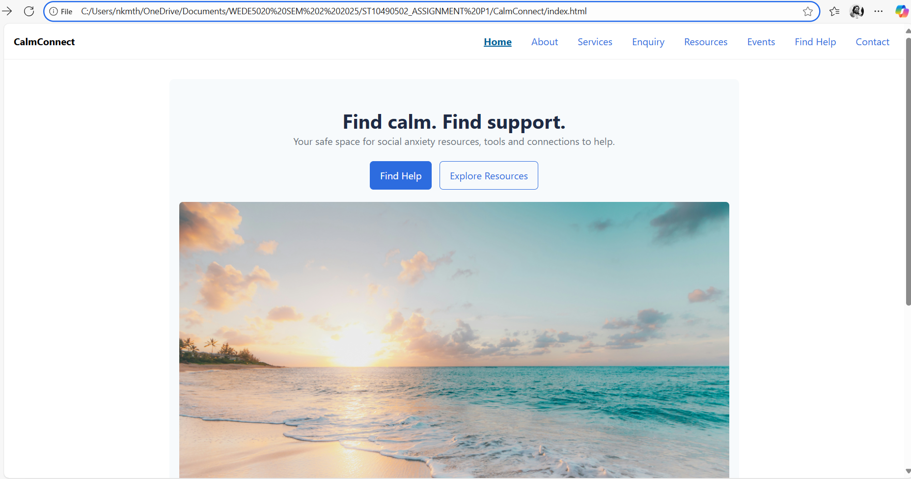

# CalmConnect — WEDE5020 Assignment Part 1

## Student Information
- **Name:** Nsovo Kelsey Mthembi
- **Student Number:** ST10490502
- **Module:** WEDE5020 – Website Development
- **Semester:** 2 (2025)

---

## Project Overview
**CalmConnect** is a supportive online space providing tools, resources and connections for people living with social anxiety.
The website promotes mental health awareness and access to help in a stigma-free environment.

---

## Website Goals and Objectives
- Create a **safe, calm, stigma-free** digital space
- Provide **accessible resources** for managing social anxiety
- Offer **connections to help** (hotlines, therapists, community support)
- Support learning through **resources, workshops, and events**

---

## Website Pages
- Home – Hero image, quick links
- About – Mission, vision, team bios
- Services – Overview of platform services
- Enquiry – Form for questions, volunteering, sponsorship
- Resources – Breathing exercise, CBT basics, journaling prompts
- Events – Webinars and group sessions (events table)
- Find Help – SA hotlines, directories, disclaimer
- Contact – Contact details, 2 map locations, message form

---

## Sitemaps

### High-Level Sitemap

### Detailed Sitemap

---

## Wireframes

### Home Page

### About Page

### Services Page

### Enquiry Page

### Resources Page

### Events Page

### Find Help Page

### Contact Page

---

## Accessibility & Structure
- Semantic HTML (`header`, `main`, `section`, `footer`)
- Navigation uses `aria-label="Primary"` and `aria-current="page"`
- Descriptive `alt` text for images
- Forms labelled and include `required` attributes
- Responsive design with CSS Grid for cards, forms, and maps

---

## Changelog
- **Part 1 (27-08-2025):**
- Created full HTML page structure (Home, About, Services, Enquiry, Resources, Events, Find Help, Contact).
- Added base CSS for layout, typography, forms, and responsiveness.
- Added sitemap (2 versions) and wireframes (8 total).

---

## References
- SADAG 2025, *Helplines*, viewed Aug 2025, <https://www.sadag.org>
- LifeLine South Africa 2025, *Counselling Line*, viewed Aug 2025, <https://lifelinesa.co.za>
- Akeso Clinics 2025, *Psychiatric Response Unit*, viewed Aug 2025, <https://www.akeso.co.za>
- South African Government 2025, *Emergency numbers*, viewed Aug 2025, <https://www.gov.za>

---

## Image Credits
- `images/sunset.jpg` – Stock image (Unsplash/Sean Oulashin, <https://unsplash.com/@oulashin> )
- `images/sitemap1.png`, `images/sitemap2.png`, and all `wireframe_*.png` – Created diagrams for assignment submission

---

# CalmConnect — WEDE5020 Assignment Part 2

# CalmConnect Website

## Overview
CalmConnect is a website project aimed at supporting individuals with social anxiety by providing resources, events, and easy access to help.

---

## Progress Summary – Part 2
- Implemented **external CSS file (`style.css`)** linked to all HTML pages.
- Established **base styling** with typography, colour scheme, and consistent layout.
- Applied **Flexbox and CSS Grid** for layout across pages.
- Enhanced **visual styles**: buttons, cards, forms, tables.
- Added **responsive design** with media queries for desktop, tablet, and mobile.
- Ensured accessibility improvements (semantic HTML, alt text, colour contrast).
- Tested across multiple screen sizes.

---

## Responsive Design Evidence
Screenshots below demonstrate the site at different breakpoints:

- Desktop (≥1024px)  
  

- Tablet (~768px)  
  

- Mobile (≤640px)  
  

---

## Changelog
- **10-09-2025:** Updated navigation styles with hover/focus states.  
- **26-09-2025:** Moved all inline CSS into external `style.css`.  
- **12-09-2025:** Implemented Flexbox and Grid layouts for services, team, and forms.  
- **02-09-2025:** Added responsive breakpoints at 1024px (tablet) and 640px (mobile).  
- **15-09-2025:** Styled buttons with transitions and hover effects.  
- **26-09-2025:** Polished typography using relative units (`rem`).  
- **12-09-2025:** Improved accessibility: added alt text, consistent colour contrast.  

---

## References
- W3C. [Web Content Accessibility Guidelines (WCAG) 2.1](https://www.w3.org/TR/WCAG21/)  
- Mozilla Developer Network (MDN). [CSS Layout: Flexbox](https://developer.mozilla.org/en-US/docs/Web/CSS/CSS_Flexible_Box_Layout/Basic_Concepts_of_Flexbox)  
- Mozilla Developer Network (MDN). [CSS Layout: Grid](https://developer.mozilla.org/en-US/docs/Web/CSS/CSS_Grid_Layout)  
- Nielsen Norman Group. [Designing for Accessibility](https://www.nngroup.com/topic/accessibility/)

---
